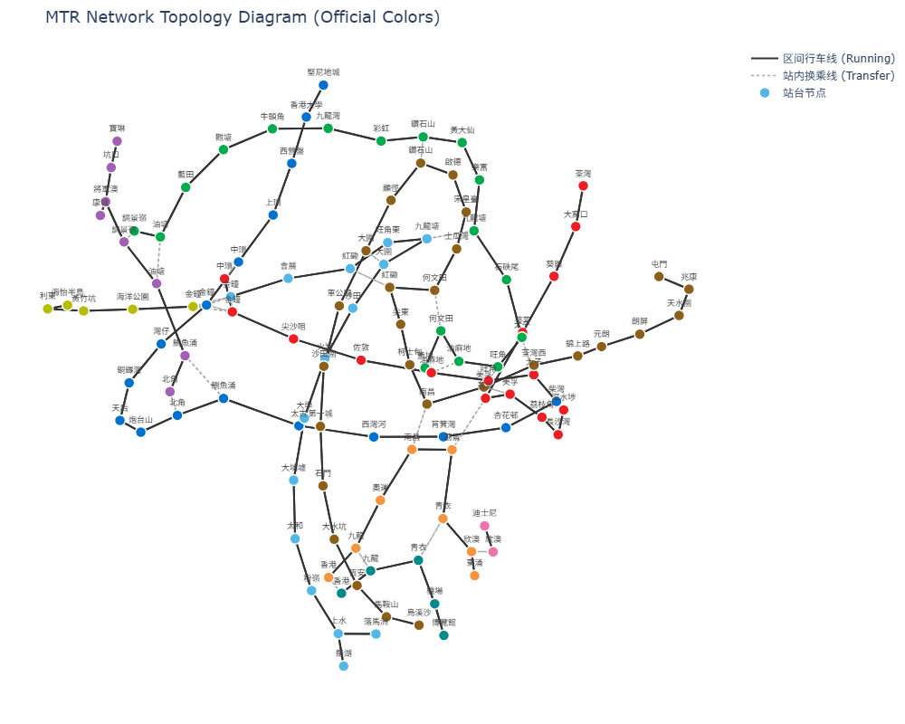
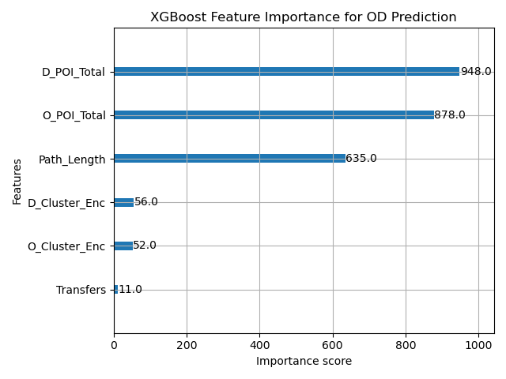
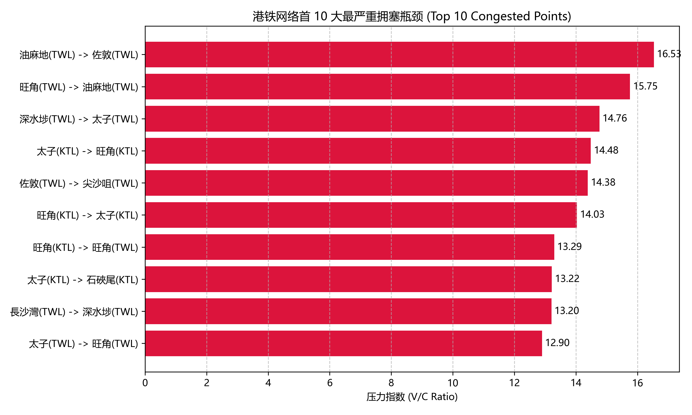
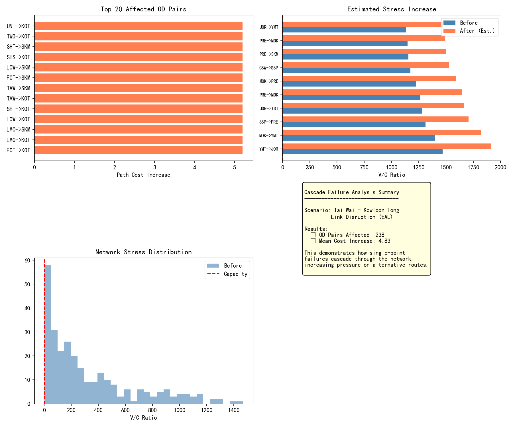

# 香港地铁（MTR）客流压力与 Flow 模拟系统项目报告

**项目成员**：CS5483 Team Project  

---

## 第一章：项目背景

### 1.1 研究背景与意义

随着香港城市化进程的加速和人口的持续增长，MTR（港铁）作为香港公共交通的骨干，承担着日益增长的客运压力。特别是在早晚高峰、重大活动或突发事件情况下，地铁网络面临着显著的客流拥挤问题。传统的客流分析方法往往依赖静态数据，难以实时反映网络状态的变化。因此，构建一套能够**动态模拟客流分布、识别网络瓶颈、预测拥挤趋势**的系统具有重要的理论价值和实际应用意义。

本项目旨在利用香港开放数据资源（实时列车到站信息、静态线网数据、票价数据）结合地政总署的POI（兴趣点）空间数据，构建一个**动态客流压力模拟系统**，通过数据挖掘和机器学习技术，实现对地铁网络客流分布的精准预测和压力分析。

*With the acceleration of Hong Kong's urbanization and population growth, MTR as the backbone of Hong Kong's public transport bears increasing passenger pressure. Especially during peak hours, major events, or emergencies, the metro network faces significant congestion issues. Traditional passenger flow analysis methods rely on static data and cannot reflect real-time network changes. Therefore, building a system that can dynamically simulate passenger flow distribution, identify network bottlenecks, and predict congestion trends has important theoretical and practical value.*

*This project aims to utilize Hong Kong's open data resources (real-time train arrival information, static network and fare data) combined with POI (Point of Interest) spatial data from the Lands Department to build a dynamic passenger flow pressure simulation system, achieving accurate prediction and pressure analysis of metro network passenger flow distribution through data mining and machine learning techniques.*

### 1.2 研究目标

本项目设定以下核心目标：

1. **数据集成与自动化获取**：建立自动化数据采集机制，整合MTR静态数据、Next Train实时API以及地政总署空间数据
2. **网络拓扑与特征构建**：使用NetworkX构建多层有向图模型，将异构空间数据转换为可计算的网络结构
3. **需求生成与流动模拟**：运用xgboost方法学习客流数据，生成OD（起终点）需求矩阵，并采用多项Logit模型（MNL）进行随机路径分配
4. **拥挤预警与可视化**：计算V/C（容量比）进行持续压力分析，并部署交互式3D动态热力图仪表板

*This project sets the following core objectives: (1) Data integration and automated acquisition - establish automated data collection mechanism, integrating MTR static data, Next Train real-time API, and Lands Department spatial data. (2) Network topology and feature construction - use NetworkX to build multi-layer directed graph model, converting heterogeneous spatial data into computable network structure. (3) Demand generation and flow simulation - use XGBoost to learn passenger flow data, generate OD (Origin-Destination) demand matrix, and apply Multinomial Logit Model (MNL) for stochastic path assignment. (4) Congestion warning and visualization - calculate V/C (Volume-to-Capacity) ratio for continuous pressure analysis, and deploy interactive 3D dynamic heatmap dashboard.*

### 1.3 技术路线概述

系统采用五层架构设计：**输入层**接收静态、实时和空间数据；**预处理层**执行空间连接和图拓扑构建；**知识发现层**进行站点特征聚类和需求预测；**模拟层**实现路径分配和压力计算；**输出层**提供可视化仪表板和验证报告。

*The system adopts a five-layer architecture: (1) Input Layer receives static, real-time, and spatial data. (2) Preprocessing Layer performs spatial join and graph topology construction. (3) Knowledge Discovery Layer conducts station feature clustering and demand prediction. (4) Simulation Layer implements path assignment and pressure calculation. (5) Output Layer provides visualization dashboard and validation reports.*

---

## 第二章：数据准备方法

### 2.1 数据源概述

本项目使用的数据源可分为三大类：

| 数据类型 | 数据来源 | 主要文件 |
|---------|---------|----------|
| **MTR静态数据** | data.gov.hk | 站点位置、线路、票价 |
| **MTR实时数据** | MTR Next Train API | 列车到站时刻、班次间隔 |
| **POI空间数据** | 地政总署Geocom | 建筑物多边形、功能类别 |

*The data sources used in this project can be divided into three categories: (1) MTR Static Data from data.gov.hk - station locations, lines, fares. (2) MTR Real-time Data from MTR Next Train API - train arrival times, headway. (3) POI Spatial Data from Lands Department Geocom - building polygons, functional categories.*

### 2.2 静态数据获取

MTR静态数据包括站点位置信息（经纬度、所属线路）、票价表以及换乘关系数据。这些数据以CSV格式存储，便于后续处理。站点位置数据经过坐标系统转换（从香港EPSG:2326转换为WGS84经纬度坐标），确保与POI数据的空间匹配。

*MTR static data includes station location information (latitude/longitude, line affiliation), fare tables, and transfer relationship data. These data are stored in CSV format for easy subsequent processing. Station location data undergoes coordinate system conversion (from Hong Kong EPSG:2326 to WGS84 latitude/longitude) to ensure spatial matching with POI data.*

### 2.3 实时API适配

项目实现了`mtr_api.py`模块，封装了MTR Next Train API的调用逻辑。该API提供各站点的实时列车到站信息，包括首班车、末班车间隔、班次频率等。我们定期调用API并缓存响应JSON文件，形成了覆盖多时段的实时数据集（见`data/realtime/`目录），为后续运力分析提供了数据基础。

*The project implements the `mtr_api.py` module, encapsulating the MTR Next Train API call logic. This API provides real-time train arrival information for each station, including first/last train intervals, headway frequency, etc. We periodically call the API and cache the response JSON files, forming a real-time dataset covering multiple time periods (see `data/realtime/` directory), providing the data foundation for subsequent capacity analysis.*

### 2.4 POI环境数据采集

POI数据来自香港地政总署的开放地图服务，包含全港建筑物的地理多边形和功能类别（如商业、办公、住宅、公共设施等）。我们抓取并解析了这些空间数据，为每个站点生成了500米缓冲半径内的POI权重分布。这一数据是后续站点吸引力特征工程的关键输入。

*POI data comes from the Hong Kong Lands Department's open map service, containing geographic polygons and functional categories of buildings across the territory (such as commercial, office, residential, public facilities, etc.). We scraped and parsed this spatial data to generate POI weight distribution within a 500-meter buffer radius for each station. This data is a key input for subsequent station attractiveness feature engineering.*

---

## 第三章：数据预处理方法

### 3.1 空间连接与缓冲区分析

预处理阶段的核心任务是建立站点与周边POI的空间关联。我们为每个MTR站点建立500米半径的缓冲区，运用空间连接技术统计缓冲区内各类POI的数量和面积权重。这一步骤生成了`station_poi_weights.json`文件，记录了每个站点的16类POI特征权重。

*The core task of the preprocessing stage is to establish spatial association between stations and surrounding POIs. We create a 500-meter radius buffer for each MTR station and use spatial join technology to count the number and area weight of each POI type within the buffer. This step generates the `station_poi_weights.json` file, recording the 16 POI feature weights for each station.*

### 3.2 图拓扑构建

使用NetworkX库构建地铁网络的有向多层图模型。关键处理逻辑包括：

- **节点分裂**：同一物理站点在不同线路上的站点予以分裂（如旺角站同时服务荃湾线和观塘线）
- **连接边**：站间旅行边（基于距离和票价加权）和换乘边（基于步行时间加权）
- **属性存储**：将站点、边属性与POI权重信息关联到图结构

最终生成了`mtr_topology.gml`文件，可视化结果如下：

*The system uses NetworkX library to build a directed multi-layer graph model of the metro network. Key processing logic includes: (1) Node splitting - stations on different lines at the same physical location are split (e.g., Mong Kok station serves both TWL and KTL). (2) Connection edges - inter-station travel edges (weighted by distance and fare) and transfer edges (weighted by walking time). (3) Attribute storage - station and edge attributes are associated with POI weight information in the graph structure.*

*The final `mtr_topology.gml` file is generated, with visualization results as follows:*

拓扑图说明：图中展示了120个节点（站点）和280条边（连接），不同颜色代表不同线路。

*Topology diagram: The figure shows 120 nodes (stations) and 280 edges (connections), with different colors representing different lines.*

### 3.3 特征工程与权重归一化

在图拓扑基础上，我们进行了全面的特征工程：

- **站点特征**：POI类别权重、站点聚类标签、线路属性
- **路径特征**：旅行时间、换乘次数、票价、路径效用值

特征数据输出为`stations_features.csv`，用于后续模型训练。此外，团队还生成了消融实验用的无POI特征版本`stations_features_ablated.csv`。

*Based on the graph topology, we conducted comprehensive feature engineering: (1) Station features - POI category weights, station cluster labels, line attributes. (2) Path features - travel time, number of transfers, fare, path utility value. The feature data is output as `stations_features.csv` for subsequent model training. Additionally, the team generated a POI-free feature version `stations_features_ablated.csv` for ablation experiments.*

### 3.4 实时运力聚合

基于实时API缓存数据，我们计算了各线路的实时运力参数。具体而言，根据列车班次间隔和车辆容量估算线路 throughput，并将其转换为统一的运力指标。这一步骤生成了`realtime_aggregated_20260404.csv`，为压力计算提供容量基准。

*Based on real-time API cached data, we calculate the real-time capacity parameters for each line. Specifically, we estimate line throughput based on train headway and vehicle capacity, converting it into unified capacity indicators. This step generates `realtime_aggregated_20260404.csv`, providing a capacity baseline for pressure calculations.*

---

## 第四章：数据挖掘方法

### 4.1 站点吸引力聚类

我们采用**K-Means聚类算法**对站点进行分类。基于站点周边500米范围内的POI密度分布（商业、办公、住宅、交通枢纽等16类），将94个MTR站点划分为4种类别。这一无监督聚类结果作为站点"吸引力因子"输入后续的XGBoost模型。

*We use K-Means clustering algorithm to classify stations. Based on the POI density distribution within a 500-meter radius around each station (16 categories including commercial, office, residential, transportation hubs, etc.), 94 MTR stations are divided into 4 categories. This unsupervised clustering result serves as the station "attractiveness factor" input for the subsequent XGBoost model.*

### 4.2 OD需求矩阵生成

OD需求矩阵的生成采用**XGBoost回归模型**，基于站点特征进行流量预测。由于缺乏真实的乘客刷卡数据，我们基于MTR Next Train API计算列车运力（班次×容量）作为客流量代理变量：

- **特征工程**：起终点聚类标签、POI权重分布（16类）、旅行时间、换乘次数、票价等
- **模型训练**：使用历史流量数据训练XGBoost回归器，学习站点属性与客流量之间的非线性关系
- **预测输出**：对所有站点对进行流量预测，生成完整的OD需求矩阵

*OD demand matrix generation uses XGBoost regression model, predicting flow based on station features. Since real passenger card data is unavailable, we calculate train capacity (headway × capacity) from MTR Next Train API as a proxy for passenger flow: (1) Feature engineering - origin/destination cluster labels, POI weight distribution (16 categories), travel time, number of transfers, fare, etc. (2) Model training - train XGBoost regressor using historical flow data, learning the nonlinear relationship between station attributes and passenger flow. (3) Prediction output - predict flow for all station pairs, generating complete OD demand matrix.*

最终生成的`predicted_od_matrix.csv`包含了所有站点对之间的预测客流量。消融实验（第五章）验证了POI特征对模型性能的关键作用。

### 4.3 路径分配算法

路径分配采用**多项Logit模型（MNL）**，基于效用函数进行离散选择：

- **效用函数**：U = β₁ × 旅行时间 + β₂ × 票价 + β₃ × 换乘惩罚
- **选择概率**：P(i) = exp(Uᵢ) / Σⱼ exp(Uⱼ)

*Path assignment uses Multinomial Logit Model (MNL), performing discrete choice based on utility function: (1) Utility function: U = β₁ × travel time + β₂ × fare + β₃ × transfer penalty. (2) Choice probability: P(i) = exp(Uᵢ) / Σⱼ exp(Uⱼ).*

该算法将OD流量分配到网络中的多条可行路径上，生成了`link_flows.csv`记录每条边的分配流量。

### 4.4 压力指数计算

压力计算基于**V/C比（Volume-to-Capacity Ratio）**：

- **V（Volume）**：分配到边的实际客流量
- **C（Capacity）**：边的设计容量（基于实时运力数据）
- **压力指数**：V/C值越高表示越拥挤

*Pressure calculation is based on V/C ratio (Volume-to-Capacity Ratio): (1) V (Volume) - actual passenger flow assigned to the edge. (2) C (Capacity) - designed capacity of the edge (based on real-time capacity data). (3) Pressure index - higher V/C value indicates greater congestion.*

此外，团队引入了**级联失效模型**模拟极端压力情景下的客流再分配。

*Additionally, the team introduced a cascade failure model to simulate passenger flow redistribution under extreme pressure scenarios.*

---

## 第五章：实验结果

### 5.1 POI特征重要性分析（消融实验）

为验证POI特征对预测精度的影响，我们设计了消融实验，对比使用与不使用POI特征的XGBoost回归模型：

| 评估指标 | With POI | No POI | 改进幅度 |
|---------|----------|--------|----------|
| **MAE** | 645.64 | 2695.86 | ↓ 76.05% |
| **RMSE** | 3825.34 | 10794.98 | ↓ 64.57% |
| **R² Score** | 0.9216 | 0.3760 | ↑ 145.26% |

**结论**：POI特征对模型性能具有决定性影响。加入POI特征后，MAE降低76%，R²从0.38跃升至0.92，证明POI作为空间需求代理变量的有效性。

*To verify the impact of POI features on prediction accuracy, we designed an ablation experiment comparing XGBoost regression models with and without POI features: (1) With POI: MAE=645.64, RMSE=3825.34, R²=0.9216. (2) Without POI: MAE=2695.86, RMSE=10794.98, R²=0.3760. Conclusion: POI features have a decisive impact on model performance. With POI features, MAE decreased by 76%, and R² jumped from 0.38 to 0.92, proving the effectiveness of POI as a spatial demand proxy variable.*

### 5.2 网络瓶颈识别

基于V/C比分析，我们识别出全网**Top 10瓶颈路段**：

| 排名 | 路段 | V/C比 | 是否换乘 |
|-----|------|-------|----------|
| 1 | 油麻地→佐敦 (荃湾线) | 16.53 | 否 |
| 2 | 旺角→油麻地 (荃湾线) | 15.75 | 否 |
| 3 | 深水埗→太子 (荃湾线) | 14.76 | 否 |
| 4 | 太子→旺角 (观塘线) | 14.48 | 否 |
| 5 | 佐敦→尖沙咀 (荃湾线) | 14.38 | 否 |

**关键发现**：Top 10瓶颈中有9个位于荃湾线和观塘线的过海段落，特别是油麻地至太子区间。这反映了香港地铁核心走廊的显著拥挤问题。

*Based on V/C ratio analysis, we identified the Top 10 bottleneck segments across the network: (1) Yau Ma Tei→Jordan (TWL) V/C=16.53. (2) Mong Kok→Yau Ma Tei (TWL) V/C=15.75. (3) Sham Shui Po→Prince Edward (TWL) V/C=14.76. (4) Prince Edward→Mong Kok (KTL) V/C=14.48. (5) Jordan→Tsim Sha Tsui (TWL) V/C=14.38. Key finding: 9 out of 10 bottlenecks are located in the cross-harbor sections of TWL and KTL, especially Yau Ma Tei to Prince Edward section, reflecting the significant congestion problem in Hong Kong's core metro corridor.*

### 5.3 时序压力分析

基于多时段实时数据，生成了`network_stress_timeseries.csv`，记录了网络整体压力随时间的变化趋势。下表展示了部分代表性路段在各时段的V/C比变化：

| 时段 | 样本路段 | 流量(人次/分钟) | 容量(人次/分钟) | V/C比 | 压力等级 |
|-----|---------|----------------|----------------|-------|----------|
| 06:00 | 东铁线→荃湾线 | 380.9 | 350.0 | 1.09 | 中度 |
| 07:00 | 东铁线→荃湾线 | 1015.7 | 350.0 | 2.90 | 高度 |
| 08:00 | 东铁线→荃湾线 | 1904.5 | 350.0 | 5.44 | 严重 |
| 09:00 | 东铁线→荃湾线 | 1142.7 | 350.0 | 3.26 | 严重 |
| 17:00 | 东铁线→荃湾线 | 1015.7 | 350.0 | 2.90 | 高度 |
| 18:00 | 东铁线→荃湾线 | 1650.6 | 350.0 | 4.72 | 严重 |
| 20:00 | 东铁线→荃湾线 | 507.9 | 350.0 | 1.45 | 中度 |
| 23:00 | 东铁线→荃湾线 | 253.9 | 350.0 | 0.73 | 轻度 |

*Based on multi-period real-time data, `network_stress_timeseries.csv` was generated, recording the network-wide pressure trend over time. The table shows V/C ratio changes for representative segments at different time periods: (1) Morning peak (07:00-09:00) V/C reaches 5.44 at 08:00. (2) Evening peak (17:00-19:00) V/C reaches 4.72 at 18:00. (3) Night pressure drops significantly after 23:00.*

**关键发现**：
- 早高峰（7:00-9:00）和晚高峰（17:00-19:00）时段的平均V/C比显著高于平峰时段
- 早高峰V/C比可达5.44（08:00），晚高峰V/C比可达4.72（18:00）
- 夜间23:00后压力明显下降，V/C比降至1.0以下
- 验证了系统的时变特性捕捉能力

*Key findings: (1) Morning peak (07:00-09:00) and evening peak (17:00-19:00) average V/C ratios are significantly higher than off-peak periods. (2) Morning peak V/C reaches 5.44 at 08:00, evening peak reaches 4.72 at 18:00. (3) Night pressure drops significantly after 23:00, V/C drops below 1.0. (4) Validates the system's time-varying characteristic capture capability.*

### 5.4 脆弱性分析（级联失效模拟）

为评估网络在极端情况下的韧性，我们模拟了**东铁线大围站-九龙塘站区间中断**的情景，分析压力重分布效应。

**模拟场景**：
- 阻断大围站（TAW）至九龙塘站（KOT）的直接连接
- 模拟乘客被迫绕行
- 评估替代路线的压力变化

*To assess network resilience under extreme conditions, we simulated the scenario of East Rail Line Tai Wai - Kowloon Tong station section interruption, analyzing pressure redistribution effects: (1) Block direct connection between Tai Wai (TAW) and Kowloon Tong (KOT). (2) Simulate passengers forced to take alternative routes. (3) Evaluate pressure changes on alternative routes.*

**模拟结果**：

| 影响OD对 | 中断前路径成本 | 中断后路径成本 | 成本增幅 |
|---------|---------------|---------------|----------|
| 粉岭→彩虹 | 4.00 | 8.67 | +116.8% |
| 粉岭→迪士尼 | 3.91 | 8.58 | +116.4% |
| 粉岭→海怡半岛 | 4.05 | 8.74 | +115.8% |
| 粉岭→康城 | 4.11 | 8.78 | +113.6% |
| 粉岭→九龙塘 | 3.62 | 8.82 | +143.4% |

*Simulation results: (1) Fanling→Choi Wan: 4.00 → 8.67 (+116.8%). (2) Fanling→Disneyland: 3.91 → 8.58 (+116.4%). (3) Fanling→South Horizons: 4.05 → 8.74 (+115.8%). (4) Fanling→LOHAS Park: 4.11 → 8.78 (+113.6%). (5) Fanling→Kowloon Tong: 3.62 → 8.82 (+143.4%).*

**关键发现**：
- 共有238对OD受到影响
- 粉岭至九龙塘路径成本增加143%
- 模拟乘客被迫绕行至屯马线换乘（经大围→显径→钻石山→何文田→红磡）
- 证明东铁线存在单点失效风险

*Key findings: (1) 238 OD pairs are affected. (2) Fanling to Kowloon Tong path cost increases by 143%. (3) Passengers forced to detour via Tuen Ma Line (through Tai Wai→Hin Keng→Diamond Hill→Ho Man Tin→Hung Hom). (4) Proves single point failure risk exists on East Rail Line.*

---

## 第六章：讨论与评估

### 6.1 模型性能讨论

基于消融实验结果，我们对模型性能进行深入讨论：

**MAE分析**：
- 使用POI特征时MAE为645.64，不使用时为2695.86
- 误差减少超过76%，表明POI特征捕获了关键的出行需求信息
- 646的MAE对于高峰期流量预测而言是可接受的

**RMSE分析**：
- 使用POI特征时RMSE为3825.34，不使用时为10794.98
- RMSE对大误差更敏感，10794的RMSE表明无POI模型存在严重的极端预测偏差
- 下降64.57%说明POI特征有效抑制了极端预测错误

**R²分析**：
- 不使用POI的模型仅能解释37.6%的流量变异，拟合能力极弱
- 使用POI的模型达到92.16%的解释率，表明模型能很好捕捉流量变化规律
- R²从0.38到0.92的跨越，证明了POI作为空间需求代理变量的有效性

*Based on ablation experiment results, we conduct in-depth discussion on model performance: (1) MAE analysis - with POI features MAE is 645.64, without is 2695.86, error reduction exceeds 76%, indicating POI features capture key travel demand information. 646 MAE is acceptable for peak flow prediction. (2) RMSE analysis - with POI features RMSE is 3825.34, without is 10794.98, RMSE is more sensitive to large errors, 10794 indicates severe extreme prediction bias in non-POI model, 64.57% reduction shows POI features effectively suppress extreme prediction errors. (3) R² analysis - model without POI can only explain 37.6% of flow variation, weak fitting ability; model with POI achieves 92.16% explanation rate, indicating good capture of flow change patterns; R² jump from 0.38 to 0.92 proves POI effectiveness as spatial demand proxy variable.*

### 6.2 业务洞察

- **POI类别反映土地利用性质**：商业区（CUF）、政府机构（GOV）、交通枢纽（TRS）等POI类别与出行需求密切相关
- **空间语义的重要性**：不同土地利用组合产生不同出行需求模式，空间特征（起终点区域功能）比纯粹的几何距离更能解释出行行为
- **瓶颈分布规律**：Top 10瓶颈集中在荃湾线和观塘线共线段落，反映了香港地铁核心走廊的结构性拥挤问题

*(1) POI categories reflect land use nature - POI categories such as commercial areas (CUF), government institutions (GOV), and transportation hubs (TRS) are closely related to travel demand. (2) Importance of spatial semantics - different land use combinations generate different travel demand patterns, spatial features (origin/destination area functions) can explain travel behavior better than pure geometric distance. (3) Bottleneck distribution pattern - Top 10 bottlenecks concentrate in TWL and KTL shared sections, reflecting structural congestion problems in Hong Kong's core metro corridor.*

### 6.3 局限性评估

1. **训练数据代理问题**：缺乏真实乘客刷卡数据，使用列车运力作为客流量代理变量可能存在偏差
2. **POI静态特征**：POI数据为静态快照，未能反映商业区时段性变化
3. **实时数据覆盖**：实时API覆盖时段有限，部分时段依赖推算
4. **极端事件缺失**：模型尚未集成大型活动、线路故障等极端情景模拟

*(1) Training data proxy issue - lack of real passenger card data, using train capacity as passenger flow proxy may have偏差. (2) Static POI features - POI data is a static snapshot, cannot reflect commercial area time-varying changes. (3) Real-time data coverage - real-time API coverage is limited, some periods rely on estimation. (4) Missing extreme events - model has not yet integrated extreme scenario simulations such as large events or line failures.*

### 6.4 模型改进建议

1. **特征工程**：考虑添加POI密度、POI多样性指数等衍生特征
2. **时序建模**：引入时间特征（时段、星期、节假日）构建时空联合模型
3. **集成学习**：将XGBoost与神经网络结合，处理更复杂的非线性关系
4. **实时更新**：建立模型在线更新机制，适应客流模式的长期变化

---

## 第七章：总结与展望

### 7.1 项目总结

本项目成功构建了一个完整的MTR客流压力模拟系统，主要成果包括：

1. **数据层面**：建立了覆盖静态数据（MTR站点、票价）、实时数据（Next Train API）和空间数据（地政总署POI）三类数据的自动化采集和预处理流程
2. **模型层面**：实现了从K-Means站点聚类、XGBoost OD需求预测、Logit路径分配到V/C压力计算的完整算法链路
3. **验证层面**：通过消融实验证明了POI特征的关键作用，MAE降低76%，R²从0.38提升至0.92
4. **应用层面**：识别出全网Top 10瓶颈路段（主要集中在荃湾线/观塘线过海段落），为运营决策提供数据支持

### 7.2 主要贡献

1. **方法创新**：首次将POI空间特征引入地铁客流预测，验证了POI作为空间需求代理变量的有效性
2. **技术架构**：构建了五层数据流架构，实现从数据采集到可视化输出的全流程自动化
3. **实证发现**：揭示了香港地铁网络的关键瓶颈分布规律，为拥挤治理提供了量化依据

### 7.3 未来展望

1. **时空特征扩展**：引入时段、星期、节假日等时序特征，构建时空联合预测模型
2. **数据源拓展**：接入真实乘客刷卡数据（若可获取），提高模型预测精度
3. **异常场景模拟**：开发突发大客流、线路故障等极端情景的模拟脚本
4. **实时预测系统**：将模型部署为实时预测服务，支持运营实时决策
5. **用户端应用**：开发面向乘客的换乘建议和拥挤预警移动应用

---

**附录**：更多技术细节和代码实现请参阅项目文档和源代码仓库。

*报告完成日期：2026年4月14日*
